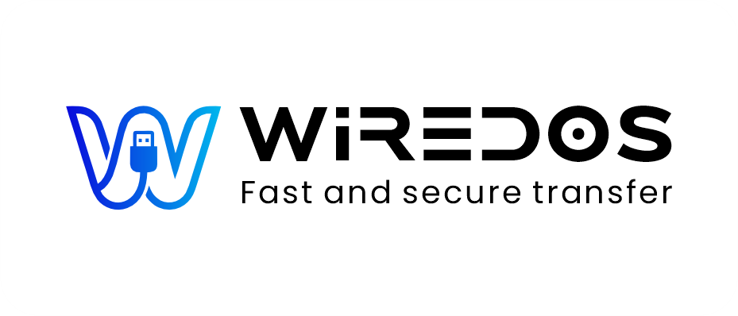

  
  <h1>Wiredos</h1>
  
<strong>The ultimate, lightning-fast iOS to PC file transfer and backup utility.</strong>

  <!-- Download Buttons -->
  

## 🚀 Overview

**Wiredos** is a modern, native Windows application built to seamlessly bridge the gap between your iPhone and your PC. Without requiring iTunes or any third-party app installations on your iOS device, Wiredos allows you to effortlessly view, manage, and back up your media.

Built with **Wails (Go + React + TypeScript)**, it offers a blazing fast backend with a beautiful, frameless, and fully responsive frontend.

## 🛡️ 100% Free & Secure

Your privacy is the absolute priority. Wiredos is **completely free to use** and **100% secure**:
- **Offline by Design:** The app processes all file transfers locally via your USB cable. Your data never leaves your computer and is never uploaded to any cloud server.
- **No Third-Party Access:** Because no companion app is installed on your phone, there are no background trackers or hidden permissions.

## 💾 Backup Capabilities

Wiredos gives you complete control over your iPhone's media with versatile backup options:
- **Full Album Backup:** Easily detect all custom and system albums on your device. Back up entire albums to your PC with a single click.
- **Selective Media Transfer:** Browse through high-quality thumbnails of your **Photos and Videos** and selectively copy only the files you need.
- **Large Video Support:** Effortlessly handles large 4K video files that normally crash standard Windows Explorer transfers.

## ✨ Key Features

- **📱 No App Required on Phone:** Connect your iPhone via USB and access your media instantly.
- **🖼️ Smart Media Gallery:** Browse your photos and videos with generated thumbnails directly on your PC before transferring.
- **🔍 Full Media Viewer:** View photos and videos in a beautiful, edge-to-edge full-size viewer with native HEIC support and keyboard navigation.
- **🗂️ Real Album Navigation:** View and browse your actual iPhone albums (like WhatsApp, Instagram, Recents) exactly as they appear on your device.
- **✨ Smart Photo Filters:** Easily filter your media by iOS attributes like Live Photos, Favorites, or Hidden files.
- **📊 Native Taskbar Progress:** Track real-time transfer progress directly on the Windows taskbar icon.
- **🛡️ Smart Storage Check:** Automatically checks destination disk space before transfers to prevent disk full errors.
- **🎨 Beautiful UI & Theming:** Enjoy a stunning, frameless design with built-in Light and Dark modes.
- **⚡ Native Performance:** Powered by Golang for system-level USB interactions ensuring maximum transfer speeds.
- **🔄 Auto Updates:** Built-in OTA updater that automatically checks GitHub releases to keep you on the latest version.

## 💻 System Requirements

- **OS:** Windows 10 or Windows 11 (64-bit)
- **Hardware:** Apple USB Cable (Lightning or USB-C to USB-A/C)
- **Memory:** Minimum 4GB RAM
- **Device Support:** Works with any iPhone or iPad running iOS 12.0 or newer.

## 📦 Installation

1. Download the latest `Wiredos.exe` from the [Releases](https://github.com/arsalbytes/Wiredos-Releases/releases) page.
2. Run the executable.
3. Connect your iPhone via USB (make sure to tap "Trust This Computer" on your phone if prompted).
4. Start transferring!

## 📝 License
Created by [Arsal Bytes](https://arsalbytes.com/). All rights reserved.
